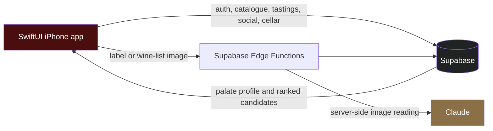
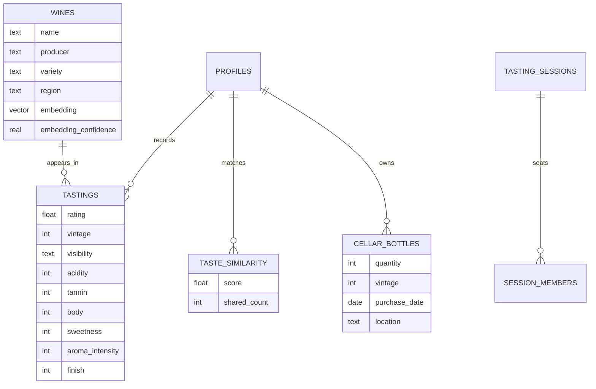

# Pari

Pari is an iOS app for remembering the wines you drink and making the next bottle easier to choose.

Record a wine, rate it out of ten, and keep the vintage, tasting notes, occasion, and visibility with that specific tasting. As the history grows, Pari builds a palate profile, finds people with similar taste, and uses that evidence to rank wines the user has not tried.

> **Source-available, not open source.** This repository is published so the work can be read and evaluated. It is not distributed with a licence to use, modify, or redistribute the code. See [LICENSE](LICENSE).

## The product

- **Remember a bottle.** Search a catalogue of roughly 100,000 wines or scan a label, then save a rating, vintage, notes, comment, and optional moment photo.
- **Control who sees the memory.** Each tasting can be public or friends-only. Profile, cellar, and reserve-list visibility are enforced separately.
- **Choose from a restaurant list.** Photograph a wine list, match recognised entries to the catalogue, and rank them for the user's palate. Uncertain matches stay visibly unidentified instead of being guessed.
- **Choose together.** A shared table session combines several people's preferences and rejects candidates that fall below a minimum fit for anyone at the table.
- **Track physical bottles.** The cellar records quantity, vintage, purchase details, and storage location. “Open tonight” uses estimated drinking windows to surface bottles that should not be forgotten.
- **Learn without requiring expertise.** A six-axis tasting structure is available to experienced users and stays out of the way for beginners.

Pari is built around personal memory and decision support. It does not try to turn a global crowd score into a universal verdict about a wine.

## How it works

Supabase provides Postgres, authentication, row-level security, storage, realtime events, and edge functions. Image-reading credentials remain server-side; no Anthropic key is included in the app binary.

Recommendations combine semantic wine structure, the user's own history, similar tasters, and community evidence. The evaluation harness measures ranking quality, catalogue coverage, and concentration so a recommender cannot look successful merely by showing the same popular bottles to everyone.

## Engineering decisions

### A vintage belongs to a tasting

The catalogue represents a wine across releases, while a vintage describes the bottle someone actually drank. Pari stores vintage on the tasting and physical bottle rather than allowing a scan to rewrite a shared catalogue row.

### A tasting is one atomic operation

Saving a tasting and publishing its matching activity happen in one database transaction. Every attempt carries an idempotency key, so retrying after a timeout confirms the original write instead of creating a duplicate. The same replay protection is used for bottle inventory changes.

### Privacy is checked where the data lives

Visibility is enforced by Postgres policies and RPCs, not only by hiding controls in SwiftUI. The rules cover direct tasting reads, feed queries, profile sections, private moment photos, block relationships, and storage ownership.

### Unknown is better than wrong

The label and wine-list flows validate provider output before using it. Low-confidence menu matches remain unmatched, provider failures keep manual search available, and the app distinguishes an empty history from a history that failed to load.

### Similarity needs meaning

Wine embeddings use a varietal and region taxonomy plus observed tasting structure. Hashing remains only as a fallback for terms the taxonomy does not recognise. User taste vectors and taste-twin similarity are computed in Postgres with pgvector and retrieved through bounded RPCs.

## Data model

The optional structural fields follow the WSET-style low-to-high scale. Catalogue traits provide a starting estimate; aggregated real tastings can gradually replace that prior as evidence accumulates.

## Reliability and verification

The current backend contract includes atomic tasting writes, per-tasting privacy, private photo access, cursor-based feeds, group sessions, bottle inventory, recommendations, moderation, and both scanning functions.

The repaired production-backed build was checked with:

- 63 iOS unit tests;
- 37 repeatable SQL regression tests;
- isolated PostgreSQL 17 with pgvector;
- live Auth, PostgREST, Storage, row-level-security, inventory, group-session, and scanning scenarios;
- an authenticated iPhone 17 Pro simulator session using the existing profile and tasting history.

These checks cover the tested contracts, not every production condition. Physical-device camera capture, SMS and email delivery, account recovery, destructive account deletion, concurrent stock races across two devices, recommendation quality over time, and production load still require separate validation.

Detailed verification notes are in [the backend repair report](docs/engineering/backend-repair-2026-09-16.md).

## Stack

- SwiftUI, iOS 17+
- Supabase Postgres, Auth, Storage, Realtime, and Edge Functions
- pgvector with HNSW retrieval
- Claude for label and wine-list image reading through server-side proxies
- [X-Wines](https://github.com/rogerioxavier/X-Wines) as the public-domain catalogue source

## Status

Pari is in active development and is not publicly released. The app runs against its live backend, but release work still includes physical-device testing, operational monitoring, App Store assets, and a broader accessibility pass.

Questions about the engineering work are welcome at aderici@unc.edu. Requests to use the code are governed by [LICENSE](LICENSE).
